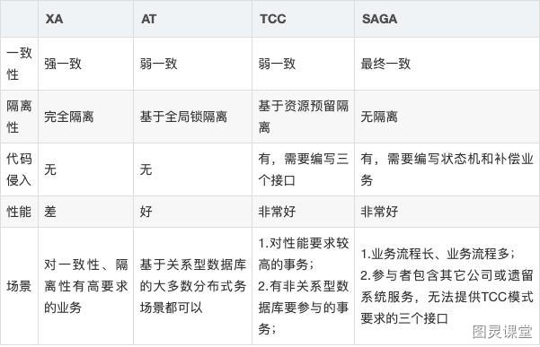

# 你们用什么？能说一下Seata吗？

:::tips
工资：12-25K
岗位：中高级开发工程师
:::

Seata是一款开源的分布式事务解决方案，致力于提供高性能和简单易用的分布式事务服务。Seata将为用户提供了AT、TCC、SAGA和XA事务模式，为用户打造一站式的分布式解决方案。

## 

## 1.1 Seata的三大角色
在 Seata 的架构中，一共有三个角色：
**TC (Transaction Coordinator) - 事务协调者**
维护全局和分支事务的状态，驱动全局事务提交或回滚。
**TM (Transaction Manager) - 事务管理器**
定义全局事务的范围：开始全局事务、提交或回滚全局事务。
**RM (Resource Manager) - 资源管理器**
管理分支事务处理的资源，与TC交谈以注册分支事务和报告分支事务的状态，并驱动分支事务提交或回滚。
其中，TC 为单独部署的 Server 服务端，TM 和 RM 为嵌入到应用中的 Client 客户端。

## XA模型

### 
1.2.Seata的XA模型
Seata对原始的XA模式做了简单的封装和改造，以适应自己的事务模型，基本架构如图：


**RM一阶段的工作：**
① 注册分支事务到TC
② 执行分支业务sql但不提交
③ 报告执行状态到TC
**TC二阶段的工作：**

- TC检测各分支事务执行状态a.如果都成功，通知所有RM提交事务b.如果有失败，通知所有RM回滚事务

**RM二阶段的工作：**

- 接收TC指令，提交或回滚事务


### 1.3.优缺点
XA模式的优点是什么？

- 事务的强一致性，满足ACID原则。
- 常用数据库都支持，实现简单，并且没有代码侵入

XA模式的缺点是什么？

- 因为一阶段需要锁定数据库资源，等待二阶段结束才释放，性能较差
- 依赖 关系型数据库 实现事务


## 2.AT模式
AT模式同样是分阶段提交的事务模型，不过缺弥补了XA模型中资源锁定周期过长的缺陷。

### 2.1.Seata的AT模型
基本流程图：


阶段一RM的工作：

- 注册分支事务
- 记录undo-log（数据快照）
- 执行业务sql并提交
- 报告事务状态

阶段二提交时RM的工作：

- 删除undo-log即可

阶段二回滚时RM的工作：

- 根据undo-log恢复数据到更新前


### 2.2.流程梳理
我们用一个真实的业务来梳理下AT模式的原理。
比如，现在又一个数据库表，记录用户余额：

| **id** | **money** |
| --- | --- |
| 1 | 100 |

其中一个分支业务要执行的SQL为：
```sql
update tb_account set money = money - 10 where id = 1
```


AT模式下，当前分支事务**执行流程**如下：
**一阶段：**
1）TM发起并注册全局事务到TC
2）TM调用分支事务
3）分支事务准备执行业务SQL
4）RM拦截业务SQL，根据where条件查询原始数据，形成快照。
```json
{
    "id": 1, "money": 100
}
```
5）RM执行业务SQL，提交本地事务，释放数据库锁。此时 money = 90
6）RM报告本地事务状态给TC

**二阶段：**
1）TM通知TC事务结束
2）TC检查分支事务状态
a）如果都成功，则立即删除快照
b）如果有分支事务失败，需要回滚。读取快照数据（{"id": 1, "money": 100}），将快照恢复到数据库。此时数据库再次恢复为100


### 2.3.脏写问题
在多线程并发访问AT模式的分布式事务时，有可能出现脏写问题，如图：

解决思路就是引入了全局锁的概念。在释放DB锁之前，先拿到全局锁。避免同一时刻有另外一个事务来操作当前数据。


- > 但是也可能在一个极端的情况下造成脏读,比如一个非Seata管理的全局事务，在事务1提交事务释放DB锁之后获取了DB锁，从而造成脏写问题。 > 这时事务1会根据快照数据发现异常，发出警告，进行人工介入。


### 2.4.优缺点
AT模式的优点：

- 一阶段完成直接提交事务，释放数据库资源，性能比较好
- 利用全局锁实现读写隔离
- 没有代码侵入，框架自动完成回滚和提交

AT模式的缺点：

- 两阶段之间属于软状态，属于最终一致
- 框架的快照功能会影响性能，但比XA模式要好很多


## 3.AT与XA的区别
简述AT模式与XA模式最大的区别是什么？

- XA模式一阶段不提交事务，锁定资源；AT模式一阶段直接提交，不锁定资源。
- XA模式依赖数据库机制实现回滚；AT模式利用数据快照实现数据回滚。
- XA模式强一致；AT模式最终一致


> 原文: <https://www.yuque.com/tulingzhouyu/db22bv/qkonkyxh8cti4k7k>